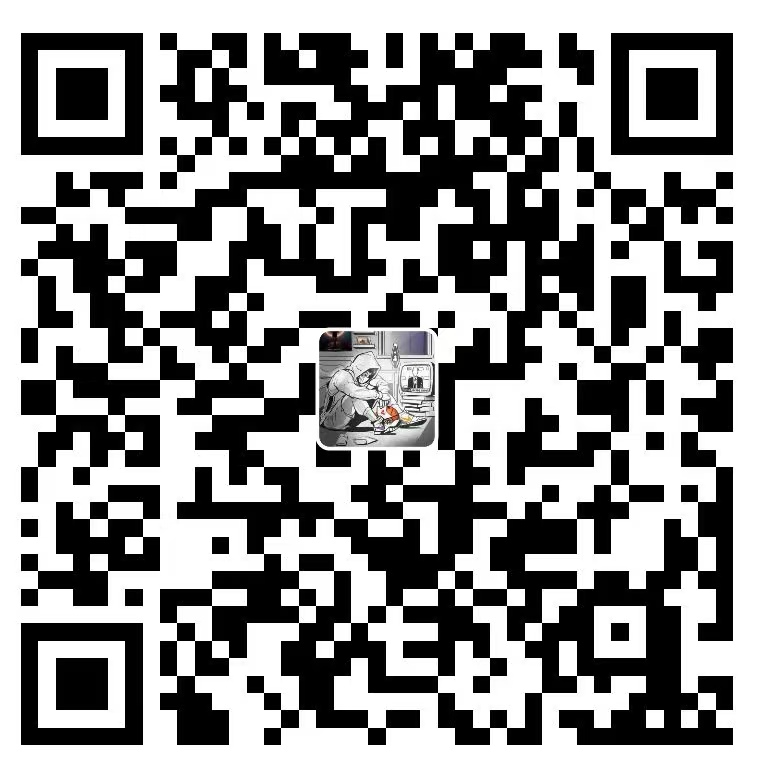

# python_base
# 🐍 Python_Base

📚 一个从零开始的 Python 学习项目，涵盖基础语法、数据结构、函数编程、文件操作、模块使用、数据分析、自动化脚本等内容，适合初学者逐步提升编程能力。

<picture>
  <source media="(prefers-color-scheme: dark)" srcset="https://user-images.githubusercontent.com/25423296/163456776-7f95b81a-f1ed-45f7-b7ab-8fa810d529fa.png">
  <source media="(prefers-color-scheme: light)" srcset="https://user-images.githubusercontent.com/25423296/163456779-a8556205-d0a5-45e2-ac17-42d089e3c3f8.png">
  
</picture>
---

## 📁 项目结构

[1、各种数据类型](./day4)\
[2、类和对象](./day5/5-类和对象.py)\
[3、多态和继承](./day6)\
[4、包和模块](./day7/3-使用包.py)\
[5、pytorch](./pytorch)\
[6、jupyter使用教程](./day10)\
[7、matplotlib](./day11)\
[8、pandas](./day12)\
[9、特征工程](./day13/1-特征工程.ipynb)\
[10、机器学习分类算法](./day13/2-机器学习分类算法.ipynb)

🚀 如何使用
1. 克隆项目

git clone https://github.com/Zhangxulang/Python_Base.git
cd Python_Base
2. 运行示例代码

python day01/hello_world.py
3. 运行自动提交脚本（Windows）

tools/auto_push.bat
💡 学习建议
每天坚持完成一个子目录内容；

多写、多练、多出错、多总结；

推荐手写笔记或思维导图辅助记忆；

👨‍💻 开发者信息
作者：@Zhangxulang

Gitee 镜像仓库：https://gitee.com/zhang-xulang/python_base

欢迎交流与建议！

⭐ Star & Fork
如果你觉得这个项目对你有帮助，欢迎点击右上角 Star ⭐ 支持一下！

也欢迎 Fork 后提交 PR 一起完善内容。有价值开源项目，是综合评定出的优秀开源项目
5.  Gitee 官方提供的使用手册 [https://gitee.com/help](https://gitee.com/help)
6.  Gitee 封面人物是一档用来展示 Gitee 会员风采的栏目 [https://gitee.com/gitee-stars/](https://gitee.com/gitee-stars/)

# 声明

部分内容整理自互联网，如有侵权，请联系我，我会第一时间处理。

---

## 📝 个人微信公众号
---

## ☕ 赞助与支持
这些内容都是我花了不少时间整理和总结出来的。  
如果你觉得它对你有帮助，请分享给更多需要学习的朋友们。  
如果你认可我的分享，也可以考虑适当的赞助支持，让我有更多动力持续产出优质内容。  

| 微信                                                         | 支付宝                                                       |
| ------------------------------------------------------------ | ------------------------------------------------------------ |
|  |  |

---

## 📬 联系方式
- **Email**：Zhangxulang@gmail.com  
- **WX**：请备注说明（有任何问题都可以直接怼我 😄）  

